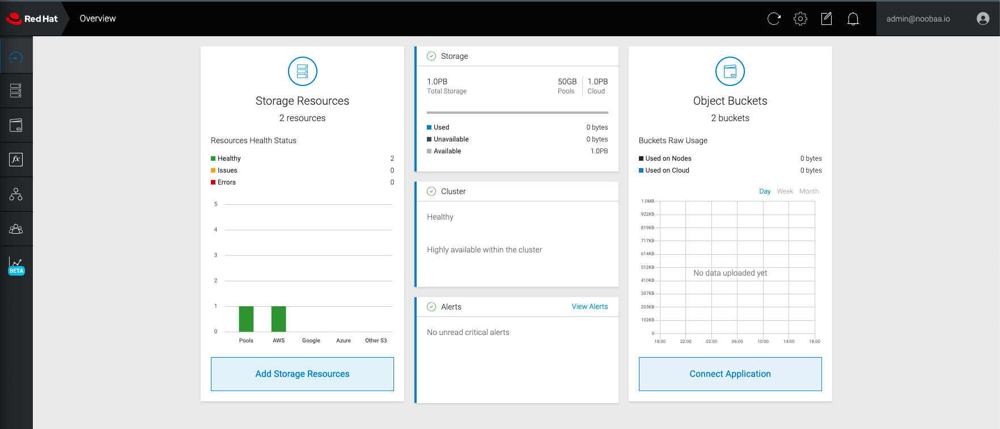

# Quay OpenShift Demo

This repository shows how to install Quay in Openshift using the different Operators.


## Requirements
1. OpenShift Cluster
    * At least 8Gi of memory.
    * At 2000 millicores of CPU.
1. OpenShift CLI
1. Object Storage, which will be provided with OpenShift Data Foundation.


## Install the OpenShift Data Foundation Operator

In this demo we wil be using a Standalone instance installation option for OpenShift Data Foundation. For a production deployment we should installed with High Availability. Refer to the [official documentation](https://access.redhat.com/documentation/en-us/red_hat_openshift_data_foundation/4.9)


* From the Operator Hub. Find the OpenShift Data Foundation and client install. Leave eaverything as default.


#### Create the Storage using the command line.

1. Connect to your Openshift Cluster using the  CLI 
1. Create NooBaa object storage. Save the following YAML to a file called _noobaa.yaml_
    ```
    apiVersion: noobaa.io/v1alpha1
    kind: NooBaa
    metadata:
        name: noobaa
        namespace: openshift-storage
    spec:
      dbResources:
      requests:
        cpu: '0.1'
        memory: 1Gi
      dbType: postgres
      coreResources:
        requests:
          cpu: '0.1'
          memory: 1Gi
    ```

1. Apply the following configuration on your cluster.
    ```
    oc create -n openshift-storage -f noobaa.yaml
    ```
1. After a couple of minutes, you should see that the MCG instance has finished provisioning (PHASE column will be set to Ready):
    ```
    oc get -n openshift-storage noobaas noobaa -w
    ```
1. Next, configure a backing store for the gateway. Save the following YAML to a file called _noobaa-pv-backing-store.yaml_
    ```
    apiVersion: noobaa.io/v1alpha1
    kind: BackingStore
    metadata:
      finalizers:
      - noobaa.io/finalizer
      labels:
        app: noobaa
      name: noobaa-pv-backing-store
      namespace: openshift-storage
    spec:
      pvPool:
        numVolumes: 1
        resources:
          requests:
            storage: 50Gi 
    type: pv-pool
    ```
1. Apply the configuration with the following command:
    ```
    oc create -f noobaa-pv-backing-store.yaml
    ```
1. Finally, run the following command to make the PersistentVolume backing store the default for all ObjectBucketClaims issued by the Operator.
    ```
    oc patch bucketclass noobaa-default-bucket-class --patch '{"spec":{"placementPolicy":{"tiers":[{"backingStores":["noobaa-pv-backing-store"]}]}}}' --type merge -n openshift-storage
    ```

#### Noobaa admin Interface

You can now access the nooba interface. To do so you need the following information. These are found under the opensift-storage project.

* The route: Networking->Routes->noobaa-mgmt
* The connection secrets: Secrets-noobaa-admin



## Install the Quay Operator

* Create a new project
    * name: quay-enterprise
    * Display name: quay enterprise


* From the Operator Hub. Fid the OpenShift Data Foundation and client install. Leave eaverything as default.


* Select the Red Hat Quay Operator
* Install in the newly created project


* Go into the operator View


    * Create a Quay Registry
    * Name: thecat-registry
    :warning: got to the Yaml view and remove everyting from spec down.
    * Wait for a few minutes to finish configurations.

* After a few minutes all should be started and configure


* You can access Quay using the different URL given
    * For the config portion use the Config Editor Endpoint route
    * For the repository use the Registry Endpoint route.


## Connecting to Quay Registry

:warning: By default there is no user created when you install Quay.  You either need to link an identify provider or create Account.

There is 2 options, either you create a user directly into quay, or you can connect to an external OAuth such as Red Hat, GitHub, Google Authentication and more.

In this demo we will investigate 2 different options. 

### Option 1: Create an account in Quay

1. Connect to the Quay Registry using the url provided in the Registry Endpoint. Create a user __Admin/admin001__


1. Sign in using the new user you have just created.


### Option 2: Connect Quay to RedHat SSO.

In other to do that you need to have an instance of Red Hat SSO running.

* In Red Hat SSO
    1. Create a Realm.  __Name: Quay__
    1. Create a user.
    1. Create a clients.
        * __Client ID: quay-demo
        * __AccessType: confidential
        * Validate Redicect URis: Use the callback from the Quay Config with wildcard. _ex: https://thecat-registry-quay-quay-enterprise.apps.cluster-vckpj.vckpj.sandbox1879.opentlc.com/oauth2/rhsso/*_

* In Quay Config Editor
    1. Select Add OIDC Provider
        

        Enter the name __rhsso__
        
    1. Enter the correct information. As per that example.
        

    1. Click validate config at the end of the page
        
    1. Click Reconfigure Quay
        

* You are done, you should now be able to connect with RH SSO
    
    


## Test adding images and pulling images

1. Add a new images by copying an image from a another locations. An images with errors is uses, this allow us to validate that clair is also install. To copy the image we will use skopeo.

    * first login to the new quay registry
    > skopeo login QUAY_URL

    * copy the image using skopeo copy
    > skopeo copy --destination-verify=false SOURCE DESTINATION

    ```
    skopeo copy --dest-tls-verify=false docker://quay.io/froberge/jersey-product-service:0.0.2-SNAPSHOT docker://[QUAY_URL]/admin/jersey-product-service:latest
    ```

    * Once the copy is done, you should see it on the UI
    

    * Go into tags, you should see the result of the security scan
    

1. Now that we were able to copy and image into Quay, let's try to do a pull.

    * From the command line login into Quay using docker login
    > docker login -u admin [QUAY_URL]

    * Pull the _admin/jersey_product-service:latest images
    > docker pull [QUAY_URL]/[REPOSITORY]:tag
    ```
    docker pull [QUAY_URL]/admin/jersey-product-service
    ```
    
